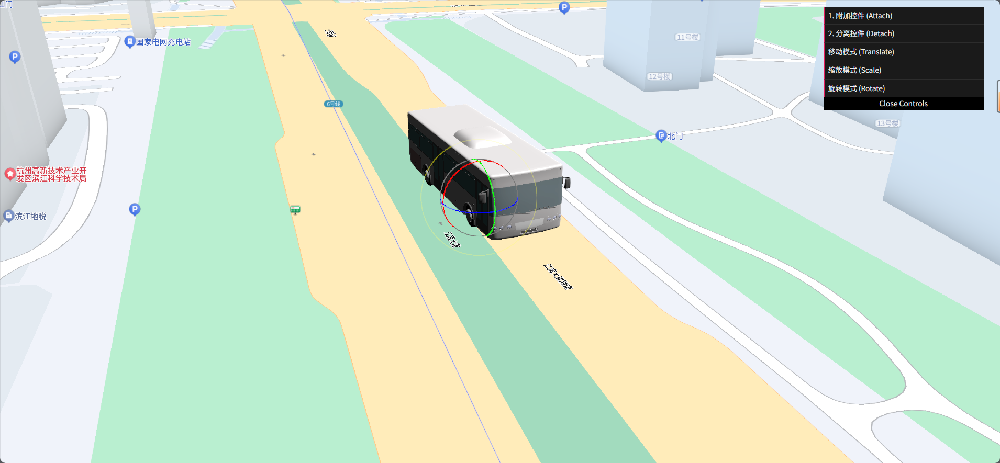

# 基于 Baidu JSAPI Three 的三维模型交互控制 Demo

## 项目简介
本项目演示如何在 React 环境下，结合 [@baidumap/mapv-three](https://lbsyun.baidu.com/faq/api?title=jsapithree) 和 Three.js，在真实的百度三维地图上实现对三维模型的交互式控制。你可以加载一个三维模型，并通过 UI 控件对其进行**移动、旋转和缩放**操作。

## 效果截图


## 环境准备
- Node.js
- VSCode (或其它代码编辑器)

## 依赖安装
在项目根目录下依次执行：

```bash
# 安装核心依赖
npm install --save react react-dom @baidumap/mapv-three three

# 安装开发与构建相关依赖
npm install --save-dev webpack webpack-cli copy-webpack-plugin html-webpack-plugin @babel/core @babel/preset-env @babel/preset-react babel-loader

# 安装 UI 控制面板依赖
npm install --save dat.gui
```

## 资源与构建配置

本项目采用 Webpack 进行打包，静态资源（如地图底图、官方模型、自定义模型等）通过 CopyWebpackPlugin 自动拷贝到输出目录。

`webpack.config.js` 关键配置如下：

```js
const path = require('path');
const CopyWebpackPlugin = require('copy-webpack-plugin');
const HtmlWebpackPlugin = require('html-webpack-plugin');

module.exports = {
    entry: './src/index.js',
    output: {
        filename: 'main.js',
        path: path.resolve(__dirname, 'dist'),
        clean: true,
    },
    plugins: [
        new CopyWebpackPlugin({
            patterns: [
                {
                    from: path.resolve(__dirname, 'node_modules/@baidumap/mapv-three/dist/assets'),
                    to: 'mapvthree/assets',
                },
            ],
        }),
        new HtmlWebpackPlugin({
            templateContent: ({htmlWebpackPlugin}) => `
                <!DOCTYPE html>
                <html lang="zh-CN">
                <head>
                    <meta charset="UTF-8">
                    <title>MapV Three Demo</title>
                    <script>
                        window.MAPV_BASE_URL = 'mapvthree/';
                    </script>
                </head>
                <body>
                    <h1>MapV Three Demo</h1>
                    <div id="container" style="width: 100vw; height: 100vh; position: fixed; left: 0; top: 0; margin: 0; padding: 0;"/>
                </body>
                </html>
            `,
            inject: 'body',
        }),
    ],
    module: {
        rules: [
            {
                test: /\.(js|jsx)$/,
                exclude: /node_modules/,
                use: {
                    loader: 'babel-loader',
                    options: {
                        presets: ['@babel/preset-env', '@babel/preset-react'],
                    },
                },
            },
            // 可根据需要添加loader配置
        ],
    },
    mode: 'development', // 可改为'production'
    resolve: {
        extensions: ['.js', '.jsx'],
    },
}; 
```

## 运行与构建

```bash
# 打包
npx webpack

# 生成的文件在 dist/ 目录下
# 用浏览器打开 dist/index.html 即可预览 Demo 效果
```

## 操作指南
1.  等待地图和巴士模型加载完成。
2.  点击页面右上角 UI 面板中的 **`1. 附加控件 (Attach)`** 按钮。
3.  点击 **`移动模式`**、**`缩放模式`** 或 **`旋转模式`** 按钮来切换不同的操作。
4.  在三维视图中拖动出现的辅助控件，即可对巴士模型进行变换。


## 目录结构说明
```
control/
├── dist/                        # 构建输出目录
│   ├── main.js
│   ├── index.html
│   └── mapvthree/assets/        # 地图与模型等静态资源
├── image/                       # 效果截图
├── node_modules/                # 依赖包
├── src/                         # 源码目录
│   ├── Demo.jsx                 # Demo主组件
│   └── index.js                 # 入口文件
├── webpack.config.js            # 构建配置
├── package.json                 # 项目依赖
└── README.md                    # 项目说明
```

## 主要代码 (`src/Demo.jsx`)
该文件是整个交互控制功能的核心，负责地图初始化、模型加载、UI面板创建和事件绑定。

```js
import React, { useRef, useEffect } from 'react';
import * as mapvthree from '@baidumap/mapv-three';
import * as THREE from 'three';
import * as dat from 'dat.gui';

const Demo = () => {
    const ref = useRef();
    const guiRef = useRef();

    useEffect(() => {
        mapvthree.BaiduMapConfig.ak = '您的AK';

        const center = [120.213, 30.21, 0];
        const engine = new mapvthree.Engine(ref.current, {
            map: {
                provider: new mapvthree.BaiduVectorTileProvider(),
                center: center,
                pitch: 60,
                heading: 70,
                range: 50,
                projection: 'ECEF'
            },
            rendering: {
                enableAnimationLoop: true
            },
        });

        const model = new mapvthree.SimpleModel({
            name: 'bus',
            point: center,
            scale: 50,
            object: 'mapvthree/assets/models/twin/REALISTIC/BUS.glb',
        });
        engine.add(model);

        const transformControl = engine.selection.transformControl;
        transformControl.addEventListener('objectChange', e => {
            console.log('Model details changed:', e.target.object);
        });

        if (guiRef.current) {
            guiRef.current.destroy();
        }
        const gui = new dat.GUI();
        guiRef.current = gui;

        const events = {
            attach: () => {
                console.log('Attaching transform to model...');
                engine.selection.attachTransform(model);
            },
            detach: () => {
                console.log('Detaching transform...');
                engine.selection.detachTransform();
            },
            translate: () => {
                transformControl.setMode('translate');
            },
            scale: () => {
                transformControl.setMode('scale');
            },
            rotate: () => {
                transformControl.setMode('rotate');
            },
        };

        gui.add(events, 'attach').name('1. 附加控件 (Attach)');
        gui.add(events, 'detach').name('2. 分离控件 (Detach)');
        gui.add(events, 'translate').name('移动模式 (Translate)');
        gui.add(events, 'scale').name('缩放模式 (Scale)');
        gui.add(events, 'rotate').name('旋转模式 (Rotate)');
        ref.current.appendChild(gui.domElement);
        gui.domElement.style.position = 'absolute';
        gui.domElement.style.top = '10px';
        gui.domElement.style.right = '10px';
        gui.domElement.style.zIndex = '9999';

        return () => {
            if (guiRef.current) {
                guiRef.current.destroy();
            }
            engine.dispose();
        };
    }, []);

    return <div ref={ref} style={{ width: '100vw', height: '100vh', position: 'fixed', left: 0, top: 0 }} />;
};

export default Demo;
```

## 注意！
- 需要将 `src/Demo.jsx` 中 `mapvthree.BaiduMapConfig.ak` 的值替换为你的百度地图开发者密钥
（AK）。
- **如何获取百度地图 AK？**  
  访问[百度地图开放平台-控制台](https://lbsyun.baidu.com/apiconsole/key)注册并创建应用获取
  （要创建浏览器端类型）。

## 参考资料
- [百度地图开放平台](https://lbsyun.baidu.com/)
- [JSAPI Three官方文档](https://lbsyun.baidu.com/faq/api?title=jsapithree)

