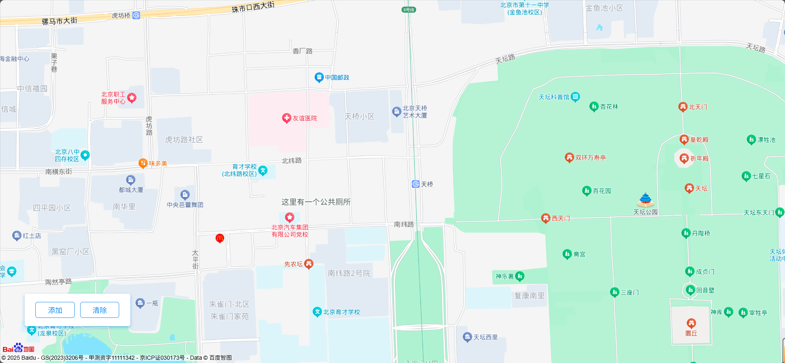

# 百度地图自定义POI示例

这个示例展示了如何使用百度地图JavaScript API GL来添加自定义POI（兴趣点）标注。



## 功能说明

- 使用 `addLabelsToMapTile` 方法添加自定义POI标注
- 支持添加文字标注和图标标注
- 提供添加和清除标注的功能
- 支持自定义标注样式（字体大小、颜色、光晕等）

## 关键点说明

1. 坐标系统：
   - 地图初始化使用经纬度坐标：`new BMapGL.Point(116.41869196404, 39.901641043953)`
   - 添加标注使用墨卡托坐标：`new BMapGL.Point(12957961.232564565, 4822048.673415739)`

2. 标注配置：
   - displayRange: [13, 21] - 控制标注在什么缩放级别范围内显示
   - textMargin: 8 - 文字边距
   - direction: 3/4 - 标注方位（3表示右侧，4表示下方）
   - uid - 标注的唯一标识符

3. 样式设置：
   ```javascript
   style: {
       fontSize: 30,
       haloSize: 2,
       color: 'rgba(80,92,88,1)',
       strokeColor: '#fff'
   }
   ```

## 使用说明

1. 引入百度地图API：
   ```html
   <script src="https://api.map.baidu.com/api?type=webgl&v=1.0&ak=您的密钥"></script>
   ```

2. 创建地图容器：
   ```html
   <div id="container"></div>
   ```

3. 初始化地图：
   ```javascript
   var map = new BMapGL.Map('container');
   var point = new BMapGL.Point(116.41869196404, 39.901641043953);
   map.centerAndZoom(point, 14);
   map.enableScrollWheelZoom();
   ```

4. 添加标注：
   - 点击"添加"按钮调用 `addLabels()` 函数
   - 点击"清除"按钮调用 `removeLabels()` 函数

## 参考文档

- [百度地图JavaScript API GL](https://lbsyun.baidu.com/index.php?title=jspopularGL)
- [官方示例Demo](https://lbsyun.baidu.com/jsdemo.htm#addLabelsToMapTile)

## 注意事项

1. 使用前需要替换为您自己的百度地图API密钥（ak）
2. 添加标注时需要使用墨卡托坐标系统
3. 建议根据实际需求调整displayRange以控制标注的显示范围
4. 可以通过修改style对象来自定义标注的样式 