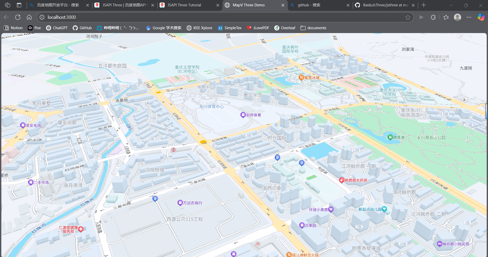

# 基于 Baidu JSAPI Three 的三维地图 React Demo

## 项目简介
本项目演示如何在 React 环境下，结合 [@baidumap/mapv-three](https://github.com/huiyan-fe/mapv-three) 和 Three.js，快速搭建一个三维地图可视化 Demo。适合初学者和有三维地图开发需求的前端开发者参考。

## 效果截图


## 环境准备
- Node.js
- VSCode

## 依赖安装
在项目根目录下依次执行：

```bash
# 安装核心依赖
npm install --save @baidumap/mapv-three three@0.158.0 react react-dom

# 安装开发与构建相关依赖
npm install --save-dev webpack webpack-cli copy-webpack-plugin html-webpack-plugin @babel/core @babel/preset-env @babel/preset-react babel-loader
```

## 资源与构建配置
本项目采用 Webpack 进行打包，静态资源（如地图底图、模型、贴图等）通过 CopyWebpackPlugin 自动拷贝到输出目录。

webpack.config.js 关键配置如下：
```js
const CopyWebpackPlugin = require('copy-webpack-plugin');
const HtmlWebpackPlugin = require('html-webpack-plugin');

module.exports = {
  entry: './src/index.js',
  output: {
    filename: 'main.js',
    path: path.resolve(__dirname, 'dist'),
    clean: true,
  },
  plugins: [
    new CopyWebpackPlugin({
      patterns: [
        { from: 'node_modules/@baidumap/mapv-three/dist/assets', to: 'mapvthree/assets' },
      ],
    }),
    new HtmlWebpackPlugin({
      templateContent: () => `
        <!DOCTYPE html>
        <html lang="zh-CN">
        <head>
          <meta charset="UTF-8">
          <title>MapV Three Demo</title>
          <script>window.MAPV_BASE_URL = 'mapvthree/';</script>
        </head>
        <body>
          <div id="container" style="width: 100vw; height: 100vh; position: fixed; left: 0; top: 0; margin: 0; padding: 0;"></div>
        </body>
        </html>
      `,
      inject: 'body',
    }),
  ],
  module: {
    rules: [
      {
        test: /\.(js|jsx)$/,
        exclude: /node_modules/,
        use: {
          loader: 'babel-loader',
          options: {
            presets: ['@babel/preset-env', '@babel/preset-react'],
          },
        },
      },
    ],
  },
  resolve: {
    extensions: ['.js', '.jsx'],
  },
  mode: 'development',
};
```

## 运行与构建

```bash
# 打包
npx webpack

# 生成的文件在 dist/ 目录下
# 用浏览器打开 dist/index.html 即可预览 Demo 效果
```

## 目录结构说明
```
jsthree/
├── dist/                # 构建输出目录
│   ├── main.js
│   ├── index.html
│   └── mapvthree/assets # 地图与模型等静态资源
├── image/               # 效果截图
├── node_modules/        # 依赖包
├── src/                 # 源码目录
│   ├── Demo.jsx         # Demo主组件
│   └── index.js         # 入口文件
├── webpack.config.js    # 构建配置
├── package.json         # 项目依赖
└── README.md            # 项目说明
```

## 主要代码讲解

### 入口文件 src/index.js
```js
import React from 'react';
import { createRoot } from 'react-dom/client';
import Demo from './Demo';

const root = createRoot(document.getElementById('container'));
root.render(<Demo />);
```
- 通过 React 的 createRoot API 挂载 Demo 组件。

### Demo 组件 src/Demo.jsx
```js
import React, { useRef, useEffect } from 'react';
import * as mapvthree from '@baidumap/mapv-three';
import * as THREE from 'three';

const Demo = () => {
    const ref = useRef();

    useEffect(() => {
        // 设置百度地图开发者密钥（AK）
        mapvthree.BaiduMapConfig.ak = '您的AK';

        // 初始化三维地图引擎
        const engine = new mapvthree.Engine(ref.current, {
            map: {
                provider: new mapvthree.BaiduVectorTileProvider(),
                center: [105.943271, 29.348709], // 初始中心点
                heading: 330,
                pitch: 60,
                range: 700,
            },
            rendering: {
                enableAnimationLoop: true,
            },
        });

        // 添加GeoJSON点数据
        const exampleDataSource = new mapvthree.GeoJSONDataSource.fromGeoJSON({
            type: 'FeatureCollection',
            features: [
                { type: 'Feature', properties: {}, geometry: { type: 'Point', coordinates: [105.941614, 29.347261] } },
                { type: 'Feature', properties: {}, geometry: { type: 'Point', coordinates: [105.941767, 29.352518] } },
            ],
        });

        // 在地图上添加圆形点
        const examplePoint = engine.add(new mapvthree.Circle({ size: 30 }));
        examplePoint.dataSource = exampleDataSource;

        // 加载三维模型（GLB）
        let model = engine.add(new mapvthree.SimpleModel({
            name: 'model',
            point: [105.943667, 29.349341],
            url: 'assets/models/building/5_tiyuzhongxin.glb',
        }));

        // 事件监听示例
        examplePoint.addEventListener('click', (e) => {
            console.log(e);
        });

        // 组件卸载时释放资源
        return () => {
            engine.dispose();
        };
    }, []);

    // 容器div全屏展示地图
    return <div ref={ref} style={{ width: '100vw', height: '100vh', position: 'fixed', left: 0, top: 0 }} />;
};

export default Demo;
```


## 注意！
需要将src/Demo.jsx中“您的AK”替换为您的开发者密钥
- **Q: 如何获取百度地图 AK？**
- A: 访问[百度地图开放平台-控制台](https://lbsyun.baidu.com/apiconsole/key)注册并创建应用获取（要创建浏览器端类型）。


## 参考资料
- [百度地图开放平台](https://lbsyun.baidu.com/)
- [JSAPI Three官方文档](https://lbsyun.baidu.com/faq/api?title=jsapithree)
