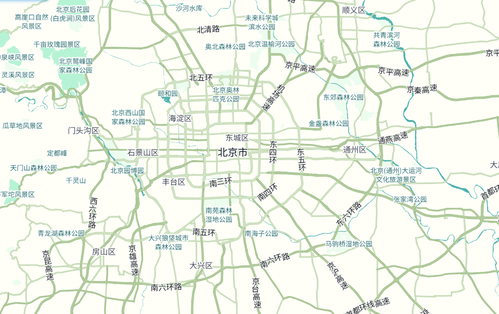
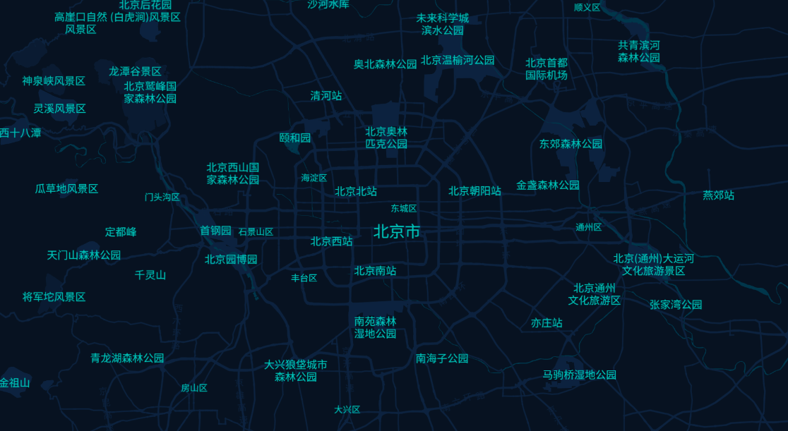
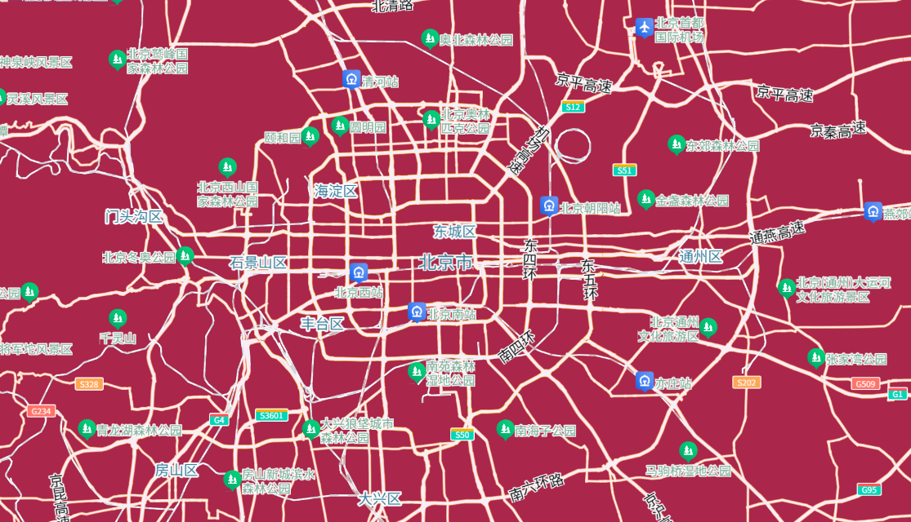
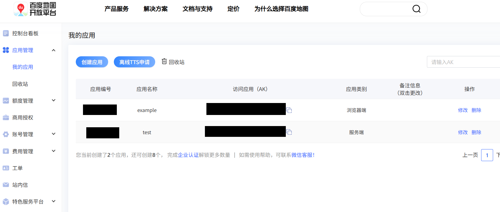
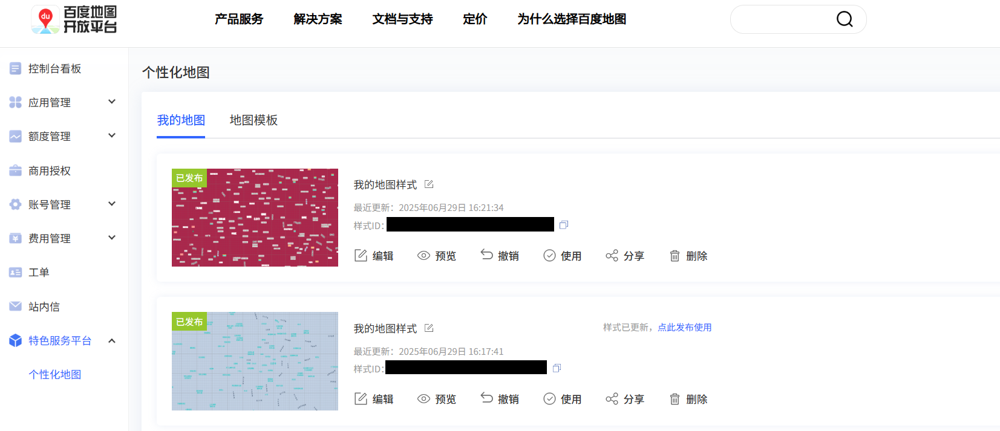

# 个性化地图
使用百度地图JS API GL实现个性化地图，可以使用模板、也可以使用根据自己的想法自定义，定制自己的专属地图。
## 效果举例

## 步骤
### 获取AK
进入百度地图开放平台，获取浏览器端AK

### 编辑地图
进入特色服务平台，编辑地图，可以使用模板，也可以自定义

### 制作Demo
- 方法一：使用GitHub仓库的[代码](https://github.com/TianweiGan/BaiduJsThree/tree/master/personalize)，替换样式ID 
- 方法二：使用百度地图开放平台[JSAPI GL](https://lbsyun.baidu.com/index.php?title=jspopularGL)的代码，可以在线编辑 

## 视频
小红书：[快来打造你的专属个性化地图！](https://www.xiaohongshu.com/discovery/item/6862498b00000000150218a2?source=webshare&xhsshare=pc_web&xsec_token=ABcwdM7tYWGdErUS74wRX3XxpfaF6ZiEae6u62bwy1pUA=&xsec_source=pc_share)

## 参考资料
- [百度地图开放平台](https://lbsyun.baidu.com/)
- [JSAPI GL文档](https://lbsyun.baidu.com/index.php?title=jspopularGL)
- [特色服务平台](https://lbsyun.baidu.com/apiconsole/custommap)