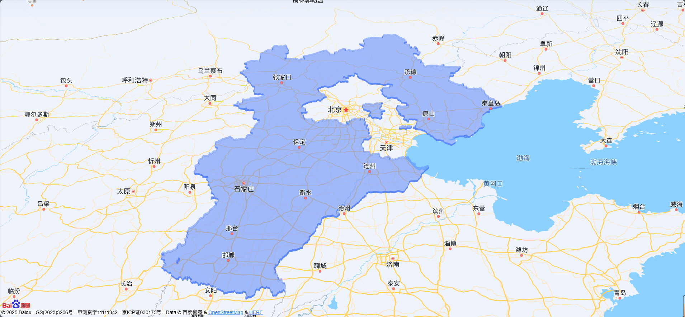

# 百度地图3D棱柱效果示例

这是一个使用百度地图JS API GL创建3D棱柱效果的示例项目。该示例展示了如何在地图上绘制行政区域的3D棱柱效果，支持自定义地图样式。


## 功能特点

- 3D棱柱可视化效果
- 行政区域边界自动获取
- 可交互的3D地图视角
- 支持鼠标滚轮缩放

## 使用方法

1. 获取百度地图API密钥
   - 访问[百度地图开放平台](https://lbsyun.baidu.com/)
   - 创建应用并获取API密钥（ak）
   - 将获取的ak替换代码中的`ak`参数

2. 运行示例
   - 直接在浏览器中打开`prism.html`文件
   - 或通过Web服务器访问该文件

## 代码示例

### 初始化地图

```javascript
var map = new BMapGL.Map("allmap");
var point = new BMapGL.Point(116.404, 39.925);
map.centerAndZoom(point, 10);
map.setTilt(50);
map.enableScrollWheelZoom();
```

### 获取行政区域边界

```javascript
var bd = new BMapGL.Boundary();
bd.get('河北省', function (rs) {
    // 处理边界数据
    // ...
});
```

### 创建3D棱柱

```javascript
var prism = new BMapGL.Prism(path, 5000, {
    topFillColor: '#5679ea',
    topFillOpacity: 0.5,
    sideFillColor: '#5679ea',
    sideFillOpacity: 0.9
});
map.addOverlay(prism);
```

## 自定义配置

### 棱柱样式配置

可以通过修改以下参数自定义棱柱的外观：

- `topFillColor`: 顶面填充颜色
- `topFillOpacity`: 顶面透明度
- `sideFillColor`: 侧面填充颜色
- `sideFillOpacity`: 侧面透明度

## 应用场景

- 城市规划展示
- 区域范围可视化
- 数据分析展示
- 地理信息系统
- 房地产开发展示

## 注意事项

1. 使用前需要有效的百度地图API密钥
2. 确保网络连接正常，因为需要实时获取地图数据

## 相关资源

- [百度地图开放平台](https://lbsyun.baidu.com/)
- [百度地图JS API GL](https://lbsyun.baidu.com/index.php?title=jspopularGL)