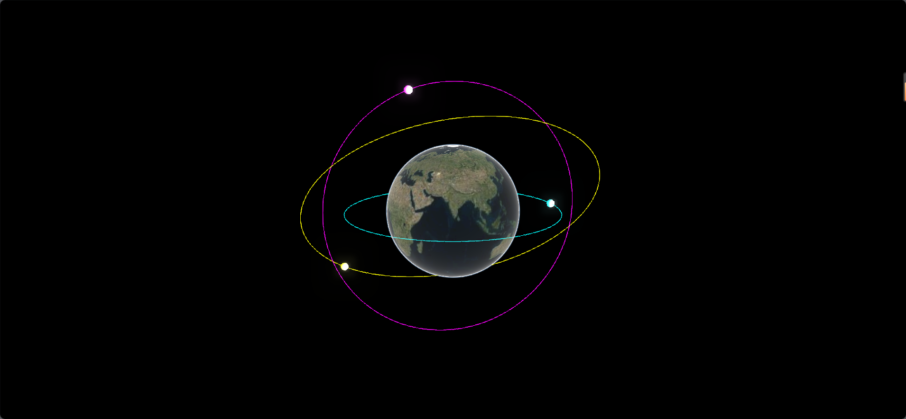

# 基于Baidu JSAPI Three的卫星轨道三维可视化Demo

## 项目简介
本项目演示如何结合 [@baidumap/mapv-three](https://lbsyun.baidu.com/faq/api?title=jsapithree)（百度地图JSAPI Three）、Three.js，实现多条卫星轨道的三维可视化，并在轨道上动态模拟卫星运动。你可以在三维地球上直观展示不同类型的卫星轨道（如赤道轨道、极地轨道、倾斜轨道），并让卫星小球体沿轨道平滑运转。

## 效果截图


## 环境准备
- Node.js
- Cursor/VSCode/...

## 依赖安装
在 satellite 目录下执行：

```bash
# 安装核心依赖
npm install --save @baidumap/mapv-three three@0.158.0 react react-dom

# 安装开发与构建相关依赖
npm install --save-dev webpack webpack-cli copy-webpack-plugin html-webpack-plugin @babel/core @babel/preset-env @babel/preset-react babel-loader
```

## 资源与构建配置
本项目采用 Webpack 进行打包，静态资源（如地图底图、轨道数据等）通过 CopyWebpackPlugin 自动拷贝到输出目录。

`webpack.config.js` 关键配置如下：
```js
const path = require('path');
const CopyWebpackPlugin = require('copy-webpack-plugin');
const HtmlWebpackPlugin = require('html-webpack-plugin');

module.exports = {
    entry: './src/index.js',
    output: {
        filename: 'main.js',
        path: path.resolve(__dirname, 'dist'),
        clean: true,
    },
    plugins: [
        new CopyWebpackPlugin({
            patterns: [
                {
                    from: path.resolve(__dirname, 'node_modules/@baidumap/mapv-three/dist/assets'),
                    to: 'mapvthree/assets',
                },
                {
                    from: path.resolve(__dirname, 'data'),
                    to: 'data',
                },
            ],
        }),
        new HtmlWebpackPlugin({
            templateContent: ({htmlWebpackPlugin}) => `
                <!DOCTYPE html>
                <html lang="zh-CN">
                <head>
                    <meta charset="UTF-8">
                    <title>MapV Three Demo</title>
                    <script>
                        window.MAPV_BASE_URL = 'mapvthree/';
                    </script>
                </head>
                <body>
                    <h1>MapV Three Demo</h1>
                    <div id="container" style="width: 100vw; height: 100vh; position: fixed; left: 0; top: 0; margin: 0; padding: 0;"></div>
                </body>
                </html>
            `,
            inject: 'body',
        }),
    ],
    module: {
        rules: [
            {
                test: /\.(js|jsx)$/,
                exclude: /node_modules/,
                use: {
                    loader: 'babel-loader',
                    options: {
                        presets: ['@babel/preset-env', '@babel/preset-react'],
                    },
                },
            },
            // 可根据需要添加loader配置
        ],
    },
    mode: 'development', // 可改为'production'
    resolve: {
        extensions: ['.js', '.jsx'],
    },
}; 
```
- 轨道数据文件 `route.geojson` 位于 `satellite/data/route.geojson`，打包后会自动复制到 `dist/data/route.geojson`，供前端可视化加载。
- 地图底图和三维资源自动拷贝到 `dist/mapvthree/assets`。

## 运行与构建

```bash
# 打包
npx webpack

# 生成的文件在 dist/ 目录下
# 用浏览器打开 dist/index.html 即可预览 Demo 效果
```

## 目录结构说明
```
satellite/
├── dist/                # 构建输出目录
│   ├── main.js
│   ├── index.html
│   ├── mapvthree/assets # 地图与模型等静态资源
│   └── data/route.geojson # 轨道数据文件
├── image/               # 效果截图
├── node_modules/        # 依赖包
├── src/                 # 源码目录
│   ├── Demo.jsx         # Demo主组件，负责地图与轨道渲染与卫星动画
│   └── index.js         # 入口文件
├── data/route.geojson   # 轨道GeoJSON数据（编辑/替换此文件可自定义轨道）
├── webpack.config.js    # 构建配置
├── package.json         # 项目依赖
└── README.md            # 项目说明
```

## 主要代码讲解

### 入口文件 `src/index.js`
```js
import React from 'react';
import { createRoot } from 'react-dom/client';
import Demo from './Demo';

const root = createRoot(document.getElementById('container'));
root.render(<Demo />);
```
- 通过 React 的 `createRoot` API 挂载 `Demo` 组件。

### Demo 组件 `src/Demo.jsx`
该文件是整个卫星轨道三维可视化的核心，负责三维地球初始化、轨道加载与卫星动画。

```js
import React, { useRef, useEffect } from 'react';
import * as mapvthree from '@baidumap/mapv-three';
import * as THREE from 'three';

const Demo = () => {
    const ref = useRef();

    useEffect(() => {
        mapvthree.BaiduMapConfig.ak = '您的AK'; // 替换为你的百度地图开发者密钥

        const engine = new mapvthree.Engine(ref.current, {
            map: {
                provider: null,
                projection: 'ECEF',
                center: [116.327824, 39.901484],
                heading: 0,
                pitch: 0,
                range: 10000000,
            },
            rendering: {
                enableAnimationLoop: true,
            },
        });
        const mapView = new mapvthree.MapView();
        engine.add(mapView);
        mapView.addSurface(new mapvthree.RasterSurface(new mapvthree.CesiumTerrainTileProvider(), new mapvthree.BingImageryTileProvider()));

        engine.rendering.bloom.enabled = true;

        // 读取轨道数据
        fetch('data/route.geojson')
            .then(res => res.json())
            .then(json => {
                const features = json.features;
                const satellites = [];
                features.forEach((feature, i) => {
                    const coords = feature.geometry.coordinates;
                    // 画轨道线
                    const line = engine.add(new mapvthree.SimpleLine({
                        color: ['#00ffff', '#ff00ff', '#ffff00'][i % 3]
                    }));
                    let data = mapvthree.GeoJSONDataSource.fromGeoJSON(feature);
                    line.dataSource = data;
                    // 创建卫星
                    const geometry = new THREE.SphereGeometry(400000, 16, 16);
                    const material = new THREE.MeshStandardMaterial({ color: 0xffffff, emissive: ['#00ffff', '#ff00ff', '#ffff00'][i % 3] });
                    const mesh = new THREE.Mesh(geometry, material);
                    satellites.push({ mesh, coords, t: 0 });
                    const first = coords[0];
                    const ecef = engine.map.projectArrayCoordinate(first, []);
                    mesh.position.set(ecef[0], ecef[1], ecef[2]);
                    engine.add(mesh);
                });
                // 动画：卫星沿轨道运动
                let running = true;
                function animate() {
                    if (!running) return;
                    satellites.forEach((sat, i) => {
                        sat.t = (sat.t + 0.2 + i * 0.01) % sat.coords.length;
                        const idx0 = Math.floor(sat.t);
                        let idx1 = (idx0 + 1) % sat.coords.length;
                        let p0 = sat.coords[idx0];
                        let p1 = sat.coords[idx1];
                        // 边界处理：如果idx0是最后一个点，idx1是0，且首尾点经纬度不同，则p1用p0
                        if (idx1 === 0 && (p0[0] !== p1[0] || p0[1] !== p1[1] || p0[2] !== p1[2])) {
                            p1 = p0;
                        }
                        const frac = sat.t - idx0;
                        const pos = [
                            p0[0] + (p1[0] - p0[0]) * frac,
                            p0[1] + (p1[1] - p0[1]) * frac,
                            p0[2] + (p1[2] - p0[2]) * frac,
                        ];
                        const ecef = engine.map.projectArrayCoordinate(pos, []);
                        sat.mesh.position.set(ecef[0], ecef[1], ecef[2]);
                    });
                    requestAnimationFrame(animate);
                }
                requestAnimationFrame(animate);
            });

        return () => {
            running = false;
            engine.dispose();
        };
    }, []);

    return <div ref={ref} style={{ width: '100vw', height: '100vh', position: 'fixed', left: 0, top: 0 }} />;
};

export default Demo;
```

## 数据文件说明
- 轨道数据文件为 `data/route.geojson`，格式为标准GeoJSON，包含多条卫星轨道（LineString），每个点为 `[经度, 纬度, 高度]`，高度单位为米。
- 可自定义轨道类型和点数，支持赤道轨道、极地轨道、倾斜轨道等。

## 注意事项
- 你需要将 `src/Demo.jsx` 中 `mapvthree.BaiduMapConfig.ak` 的值替换为你的百度地图开发者密钥（AK）。
- 如何获取百度地图 AK？访问[百度地图开放平台-控制台](https://lbsyun.baidu.com/apiconsole/key)注册并创建应用获取（需选择浏览器端类型）。

## 参考资料
- [百度地图开放平台](https://lbsyun.baidu.com/)
- [JSAPI Three官方文档](https://lbsyun.baidu.com/faq/api?title=jsapithree)
