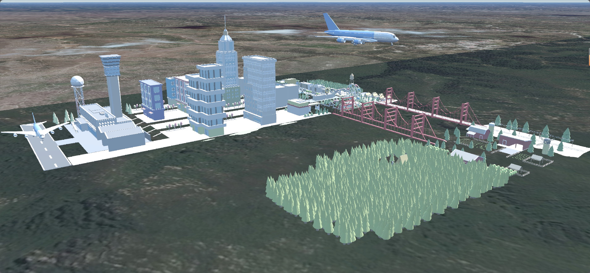

# 基于 Baidu JSAPI Three 的三维城市/庭院/等创造 Demo

## 项目简介
本项目演示如何在 React 环境下，结合 [@baidumap/mapv-three](https://lbsyun.baidu.com/faq/api?title=jsapithree) 和 Three.js，在真实的百度三维地图上自由创造属于你自己的城市、庭院等三维空间。你可以加载百度地图官方提供的静态模型，也可以导入和展示自定义的 glb 格式三维模型，实现个性化的三维场景搭建。

## 效果截图


## 环境准备
- Node.js
- VSCode

## 依赖安装
在项目根目录下依次执行：

```bash
# 安装核心依赖
npm install --save @baidumap/mapv-three three@0.158.0 react react-dom

# 安装开发与构建相关依赖
npm install --save-dev webpack webpack-cli copy-webpack-plugin html-webpack-plugin @babel/core @babel/preset-env @babel/preset-react babel-loader
```

## 资源与构建配置

本项目采用 Webpack 进行打包，静态资源（如地图底图、官方模型、自定义模型等）通过 CopyWebpackPlugin 自动拷贝到输出目录。

`webpack.config.js` 关键配置如下（已为自定义模型做了自动复制）：

```js
const path = require('path');
const CopyWebpackPlugin = require('copy-webpack-plugin');
const HtmlWebpackPlugin = require('html-webpack-plugin');

module.exports = {
    entry: './src/index.js',
    output: {
        filename: 'main.js',
        path: path.resolve(__dirname, 'dist'),
        clean: true,
    },
    plugins: [
        new CopyWebpackPlugin({
            patterns: [
                {
                    from: path.resolve(__dirname, 'node_modules/@baidumap/mapv-three/dist/assets'),
                    to: 'mapvthree/assets',
                },
                {
                    from: path.resolve(__dirname, 'models'),
                    to: 'mapvthree/assets/models',
                },
            ],
        }),
        new HtmlWebpackPlugin({
            templateContent: ({htmlWebpackPlugin}) => `
                <!DOCTYPE html>
                <html lang="zh-CN">
                <head>
                    <meta charset="UTF-8">
                    <title>MapV Three Demo</title>
                    <script>
                        window.MAPV_BASE_URL = 'mapvthree/';
                    </script>
                </head>
                <body>
                    <h1>MapV Three Demo</h1>
                    <div id="container" style="width: 100vw; height: 100vh; position: fixed; left: 0; top: 0; margin: 0; padding: 0;"/>
                </body>
                </html>
            `,
            inject: 'body',
        }),
    ],
    module: {
        rules: [
            {
                test: /\.(js|jsx)$/,
                exclude: /node_modules/,
                use: {
                    loader: 'babel-loader',
                    options: {
                        presets: ['@babel/preset-env', '@babel/preset-react'],
                    },
                },
            },
            // 可根据需要添加loader配置
        ],
    },
    mode: 'development', // 可改为'production'
    resolve: {
        extensions: ['.js', '.jsx'],
    },
}; 
```

## 运行与构建

```bash
# 打包
npx webpack

# 生成的文件在 dist/ 目录下
# 用浏览器打开 dist/index.html 即可预览 Demo 效果
```

## 目录结构说明
```
scene/
├── dist/                        # 构建输出目录
│   ├── main.js
│   ├── index.html
│   └── mapvthree/assets/        # 地图与模型等静态资源
│       └── models/              # 官方和自定义模型
│           ├── city.glb         # 你的自定义模型
│           └── ...              # 其他模型
├── image/                       # 效果截图
├── models/                      # 你自己的三维模型（glb）
│   └── city.glb
├── node_modules/                # 依赖包
├── src/                         # 源码目录
│   ├── Demo.jsx                 # Demo主组件
│   └── index.js                 # 入口文件
├── webpack.config.js            # 构建配置
├── package.json                 # 项目依赖
└── README.md                    # 项目说明
```

## 主要代码讲解

### 入口文件 `src/index.js`
```js
import React from 'react';
import { createRoot } from 'react-dom/client';
import Demo from './Demo';

const root = createRoot(document.getElementById('container'));
root.render(<Demo />);
```
- 通过 React 的 `createRoot` API 挂载 `Demo` 组件。

### Demo 组件 `src/Demo.jsx`
该文件是整个三维城市/庭院/等创造的核心，负责地图引擎初始化、模型加载与场景搭建。

```js
import React, { useRef, useEffect } from 'react';
import * as mapvthree from '@baidumap/mapv-three';
import * as THREE from 'three';

const Demo = () => {
    const ref = useRef();

    useEffect(() => {
        // 设置百度地图开发者密钥（AK）
        mapvthree.BaiduMapConfig.ak = '你的AK'; // 替换为你的实际AK

        // 初始化三维地图引擎
        const engine = new mapvthree.Engine(ref.current, {
            map: {
                provider: null,
                center: [115, 39],
                pitch: 80,
                range: 1000,
                projection: 'ECEF',
            },
            rendering: {
                enableAnimationLoop: true,
                sky: new mapvthree.DynamicSky(),
            },
        });

        const mapView = new mapvthree.MapView();
        engine.add(mapView);
        mapView.addSurface(new mapvthree.RasterSurface(new mapvthree.CesiumTerrainTileProvider(), new mapvthree.BingImageryTileProvider()));

        const weather = engine.add(new mapvthree.DynamicWeather(mapView));
        weather.weather = 'cloudy';
        weather.transitionDuration = 2000;

        // 加载百度地图官方静态模型（如树、建筑等）
        engine.add(new mapvthree.SimpleModel({
            name: 'model1',
            point: [115, 39],
            scale: new THREE.Vector3(1, 1, 1),
            object: 'mapvthree/assets/models/tree/tree18.glb',
        }));

        engine.add(new mapvthree.SimpleModel({
            name: 'model2',
            point: [115.001, 39.001],
            scale: new THREE.Vector3(1, 1, 1),
            object: 'mapvthree/assets/models/tree/tree19.glb',
        }));

        engine.add(new mapvthree.SimpleModel({
            name: 'model3',
            point: [115.002, 39.002],
            scale: new THREE.Vector3(1, 1, 1),
            object: 'mapvthree/assets/models/tree/planar/tree20.glb',
        }));

        engine.add(new mapvthree.SimpleModel({
            name: 'model4',
            point: [115.003, 39.002],
            scale: new THREE.Vector3(1, 1, 1),
            object: 'mapvthree/assets/models/hdmap/SM_Fence1-0.glb',
        }));

        // 加载你自己的自定义模型
        engine.add(new mapvthree.SimpleModel({
            name: 'model5',
            point: [115.006, 39.005],
            scale: new THREE.Vector3(1, 1, 1),
            object: 'mapvthree/assets/models/city.glb',
        }));

        // 组件卸载时释放资源
        return () => {
            engine.dispose();
        };
    }, []);

    // 容器div全屏展示地图
    return <div ref={ref} style={{ width: '100vw', height: '100vh', position: 'fixed', left: 0, top: 0 }} />;
};

export default Demo;
```

## 模型资源说明

### 1. 百度地图官方模型
- 路径：`mapvthree/assets/models/` 下的内容（如 `tree/tree18.glb` 等）。
- 这些模型由 `@baidumap/mapv-three` 官方包自动提供和复制，无需手动管理。

### 2. 自定义模型
- 请将你的 glb 格式模型放在 `scene/models/` 目录下（如 `scene/models/city.glb`）。
- 构建时会自动复制到 `dist/mapvthree/assets/models/`，你可以在代码中通过如下方式引用：
  ```js
  object: 'mapvthree/assets/models/city.glb'
  ```
- 推荐使用 glb（单文件，部署更方便）。

### 3. 如何导入自定义模型
1. 将你的模型文件（如 `myhouse.glb`）放入 `scene/models/` 目录。
2. 在 `src/Demo.jsx` 中添加如下代码：
   ```js
   engine.add(new mapvthree.SimpleModel({
       name: 'myHouse',
       point: [经度, 纬度],
       scale: new THREE.Vector3(1, 1, 1),
       object: 'mapvthree/assets/models/myhouse.glb',
   }));
   ```
3. 重新打包（`npx webpack`），即可在地图上看到你的模型。

## 注意！
- 需要将 `src/Demo.jsx` 中 `mapvthree.BaiduMapConfig.ak` 的值替换为你的百度地图开发者密钥（AK）。
- **如何获取百度地图 AK？**  
  访问[百度地图开放平台-控制台](https://lbsyun.baidu.com/apiconsole/key)注册并创建应用获取（要创建浏览器端类型）。

## 参考资料
- [百度地图开放平台](https://lbsyun.baidu.com/)
- [JSAPI Three官方文档](https://lbsyun.baidu.com/faq/api?title=jsapithree)

