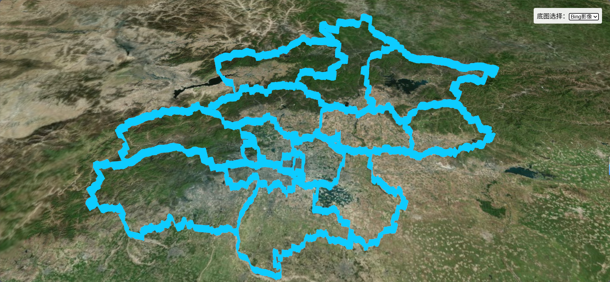
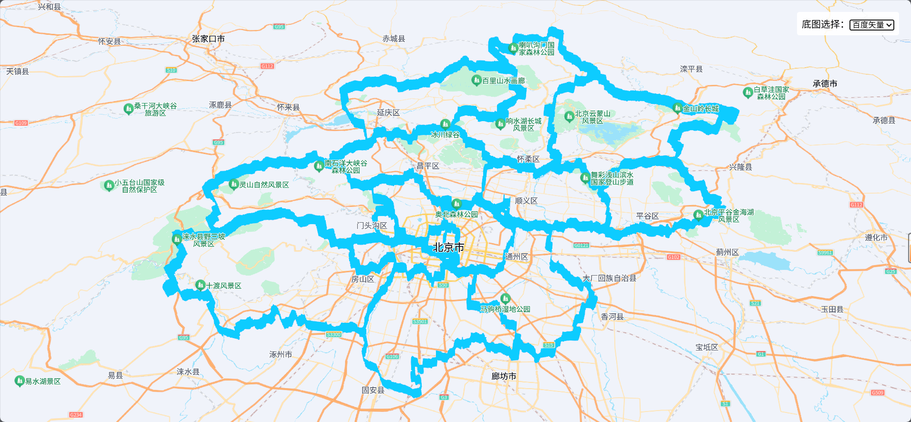
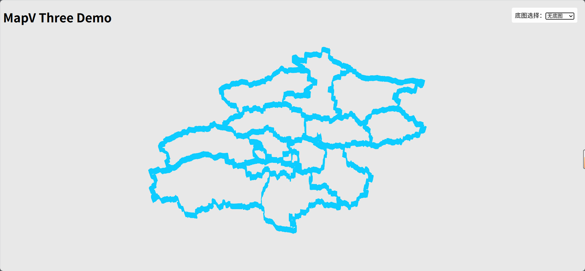

# 基于 Baidu JSAPI Three 的三维围墙可视化 Demo

## 项目简介

本项目演示如何在 React 环境下，结合 [@baidumap/mapv-three](https://lbsyun.baidu.com/jsapithree/docs/) 和 Three.js，实现北京市及其各区行政区轮廓的三维墙体可视化，并支持底图切换（Bing影像、百度矢量、无底图）。

## 效果截图





---

## 环境准备
- Node.js
- VSCode / Cursor / ...

## 依赖安装

在 wall 目录下执行：

```bash
# 安装核心依赖
npm install --save @baidumap/mapv-three three@0.158.0 react react-dom

# 安装开发与构建相关依赖
npm install --save-dev webpack webpack-cli copy-webpack-plugin html-webpack-plugin @babel/core @babel/preset-env @babel/preset-react babel-loader
```

---

## 数据与资源说明

- 行政区数据位于 `data/geojson/` 目录下：
  - `polygon.geojson`：北京市整体轮廓
  - `polygon_districts.geojson`：北京市各区轮廓
- 所有数据和静态资源会在构建时自动拷贝到 `dist/mapvthree/assets/` 下，无需手动操作。
- 其他数据可在阿里云平台下载。

---

## 目录结构

```
wall/
├── dist/                    # 构建输出目录
│   ├── main.js
│   ├── index.html
│   └── mapvthree/assets/    # 静态资源与数据
│       └── geojson/
├── data/
│   └── geojson/             # GeoJSON 数据
│       ├── polygon.geojson
│       └── polygon_districts.geojson
├── image/                   # 效果截图
│   ├── image1.png
│   └── image2.png
├── node_modules/
├── src/
│   ├── Demo.jsx             # 主功能组件
│   └── index.js             # 入口文件
├── webpack.config.js        # 构建配置
├── package.json
└── README.md
```

---

## 构建与运行

```bash
# 开发模式打包
npx webpack

# 生成的文件在 dist/ 目录下
# 用浏览器打开 dist/index.html 即可预览 Demo 效果
```

---

## 核心代码说明

### 入口文件 `src/index.js`

```js
import React from 'react';
import { createRoot } from 'react-dom/client';
import Demo from './Demo';

const root = createRoot(document.getElementById('container'));
root.render(<Demo />);
```

### 主组件 `src/Demo.jsx`

- 初始化三维地图引擎
- 加载北京市及各区 GeoJSON 数据，绘制三维墙体
- 支持底图切换（右上角下拉框）
- 墙体统一颜色，带动画
- 代码片段如下：

```js
import React, { useRef, useEffect, useState } from 'react';
import * as mapvthree from '@baidumap/mapv-three';
import * as THREE from 'three';

// provider 选项
const PROVIDERS = [
    { label: 'Bing影像', value: 'bing' },
    { label: '百度矢量', value: 'baidu' },
    { label: '无底图', value: 'none' },
];

const WALL_COLOR = '#0DCCFF';

const Demo = () => {
    const ref = useRef();
    const [provider, setProvider] = useState('bing');
    const engineRef = useRef();

    useEffect(() => {
        mapvthree.BaiduMapConfig.ak = '您的AK';

        // provider 实例
        let providerInstance = null;
        if (provider === 'bing') {
            providerInstance = new mapvthree.BingImageryTileProvider();
        } else if (provider === 'baidu') {
            providerInstance = new mapvthree.BaiduVectorTileProvider();
        } else {
            providerInstance = null;
        }

        // 创建引擎
        const engine = new mapvthree.Engine(ref.current, {
            map: {
                provider: providerInstance,
                projection: 'ECEF',
                center: [116.41439809344809, 40.08866668808574],
                pitch: 0, 
                range: 100000, 
            },
            rendering: {
                sky: null,
                enableAnimationLoop: true,
            },
        });
        engineRef.current = engine;
        engine.rendering.bloom.enabled = true;

        // 1. 绘制北京市总轮廓
        fetch('mapvthree/assets/geojson/polygon.geojson')
            .then(rs => rs.json())
            .then(rs => {
                const data = mapvthree.geojsonUtils.convertPolygon2LineString(rs);
                const wall = engine.add(
                    new mapvthree.Wall({
                        height: 5000,
                        color: WALL_COLOR,
                        enableAnimation: true,
                        animationTailType: 3,
                        animationSpeed: 1,
                        opacity: 0.5,
                    })
                );
                wall.dataSource = mapvthree.GeoJSONDataSource.fromGeoJSON(data);
            });

        // 2. 绘制各区轮廓
        fetch('mapvthree/assets/geojson/polygon_districts.geojson')
            .then(rs => rs.json())
            .then(rs => {
                if (rs && rs.features) {
                    rs.features.forEach((feature) => {
                        const data = mapvthree.geojsonUtils.convertPolygon2LineString({
                            type: 'FeatureCollection',
                            features: [feature],
                        });
                        const wall = engine.add(
                            new mapvthree.Wall({
                                height: 5000,
                                color: WALL_COLOR,
                                enableAnimation: true,
                                animationTailType: 3,
                                animationSpeed: 1,
                                opacity: 0.5,
                            })
                        );
                        wall.dataSource = mapvthree.GeoJSONDataSource.fromGeoJSON(data);
                    });
                }
            });

        // 地图点击事件
        engine.map.addEventListener('click', e => {
            console.log('点击坐标:', e.point);
        });

        return () => {
            engine.dispose();
        };
    }, [provider]);

    // provider 切换控件（右上角）
    return (
        <div ref={ref} style={{ width: '100vw', height: '100vh', position: 'fixed', left: 0, top: 0 }}>
            <div style={{ position: 'absolute', zIndex: 10, right: 20, top: 20, background: 'rgba(255,255,255,0.9)', padding: 8, borderRadius: 4 }}>
                <label>底图选择：</label>
                <select value={provider} onChange={e => setProvider(e.target.value)}>
                    {PROVIDERS.map(opt => (
                        <option key={opt.value} value={opt.value}>{opt.label}</option>
                    ))}
                </select>
            </div>
        </div>
    );
};

export default Demo;
```

---

## 数据与构建细节

- **GeoJSON 数据**：已包含北京市及各区真实行政区划数据，无需手动下载。
- **构建自动拷贝**：`webpack.config.js` 配置了 CopyWebpackPlugin，会自动将 `node_modules/@baidumap/mapv-three/dist/assets` 和 `data/` 下的所有内容拷贝到 `dist/mapvthree/assets/`，确保数据和贴图可用。
- **静态资源**：地图引擎所需的贴图、worker、模型等均自动拷贝，无需手动干预。

---

## 注意事项

- **AK 配置**：请在 `src/Demo.jsx` 中将 `mapvthree.BaiduMapConfig.ak` 替换为你自己的百度地图开发者密钥（AK）。
  - 获取方式：[百度地图开放平台-控制台](https://lbsyun.baidu.com/apiconsole/key)
  - 建议选择"浏览器端"类型
- **数据来源**：GeoJSON 行政区数据来源于阿里云开放平台，真实可靠。
- **如需自定义墙体颜色/高度/动画，可直接修改 Demo.jsx 中的 Wall 配置。**

---

## 参考资料

- [百度地图开放平台](https://lbsyun.baidu.com/)
- [JSAPI Three官方文档](https://lbsyun.baidu.com/faq/api?title=jsapithree)

